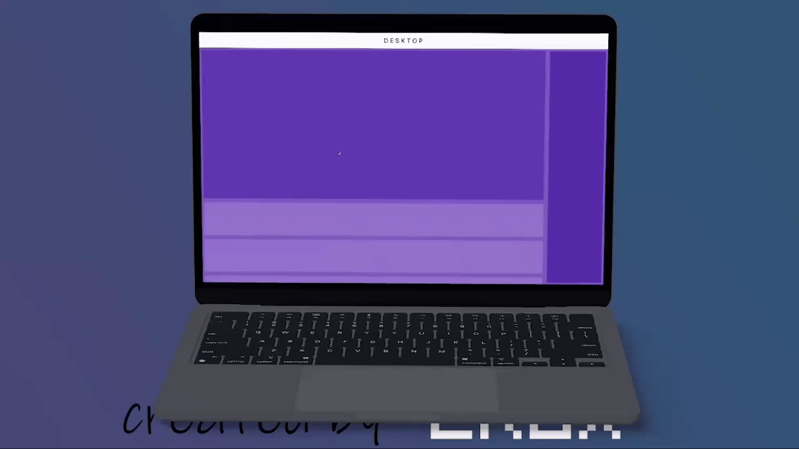

## Flutter Respensive application 
## About :
its a Youtube UI  (Responsive for mobile and desktop)


<br>

## Development Setup
Clone the repository and run the following commands:
```
flutter pub get
flutter run
```

## ScreenShot

&nbsp;
;;

